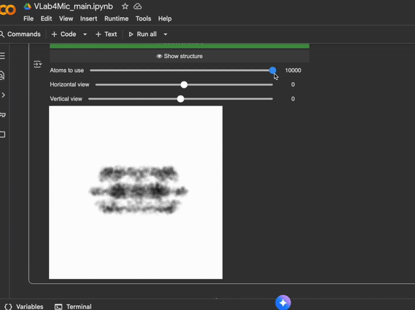

# VLab4Mic: A Virtual Laboratory for Microscopy  
*A friendly toolkit to help researchers simulate fluorescence microscopy images, no coding required.*


[](https://pypi.org/project/vlab4mic)
[](https://python.org)
[](https://pypi.org/project/vlab4mic)
[](https://github.com/HenriquesLab/vlab4mic/blob/main/LICENSE.txt)
[](https://github.com/HenriquesLab/vlab4mic/actions/workflows/package_build_test_oncall.yml)
[](https://img.shields.io/codecov/c/github/HenriquesLab/vlab4mic?branch=main)
[](https://github.com/HenriquesLab/vlab4mic/graphs/contributors)
[](https://github.com/HenriquesLab/vlab4mic/)
[](https://github.com/HenriquesLab/vlab4mic/)


VLab4Mic lets you explore, test, and validate imaging experiments **before stepping into the microscope room**.  
Whether you are new to Python or an experienced bioimage researcher, VLab4Mic provides a safe sandbox to:

- Build **virtual samples** from PDB/CIF structures  
- Apply **direct or indirect fluorescent labeling**  
- Introduce **Structural integrity**, crowding, and structural variation  
- Simulate image acquisition across modalities  
- Run **parameter sweeps** to explore experimental conditions  
- Compare **noiseless vs. realistic** acquisitions  

This README is written to be friendly for beginners while maintaining the technical depth experienced users expect.




# Who Is This Tool For?

- **New microscopy users:** to gain intuitive understanding without coding  
- **Researchers designing experiments:** testing probes, PSFs, exposure times  
- **Microscopy experts:** benchmarking reconstruction methods or PSFs  

---

# 🚀 Quick Start Options

| Option | Skills Needed | Best For |
|-------|----------------|----------|
| **1. Google Colab** | None | Beginners, teaching, quick experiments |
| **2. Local Jupyter Notebooks** | Basic installation | Smooth widget-based use |
| **3. Python Scripts** | Comfortable with code | Full flexibility & automation |

---

# 🟢 Option 1 — Google Colab (No Installation Needed)

The easiest way to start.

✔ No installation  
✔ No configuration  
✔ Works in browser  
✔ Always up to date  

### 👉 Click to open the main notebook:
| Category | Description | Notebook | Colab |
|---------|-------------|----------|-------|
| **Main Interface** | Create virtual samples & simulate imaging | [Notebook](https://github.com/HenriquesLab/VLab4Mic/blob/main/notebooks/VLab4Mic_main.ipynb) | [Open in Colab](https://githubtocolab.com/HenriquesLab/VLab4Mic/blob/main/notebooks/VLab4Mic_main.ipynb) |
| **Parameter Sweeps** | Configure & run simulation sweeps | [Notebook](https://github.com/HenriquesLab/VLab4Mic/blob/main/notebooks/VLab4Mic_parameter_sweeps.ipynb) | [Open in Colab](https://githubtocolab.com/HenriquesLab/VLab4Mic/blob/main/notebooks/VLab4Mic_parameter_sweeps.ipynb) |

### If the Colab link fails:
1. Click the **Jupyter** badge (opens the raw notebook)  
2. Download the `.ipynb` file  
3. Open Google Colab → **File → Upload notebook**  

---

# 🔵 Option 2 — Local Installation (Beginner-Friendly)

### 1️⃣ Create a virtual environment  
You may use Conda or similar.

#### Using Conda:
Run the following command (replace `MYENV` with your desired environment name):

```bash
conda create --name MYENV python=3.11
```

Then activate it:
```bash
conda activate MYENV
```

---

### 2️⃣ Install VLab4Mic and its associated library to use the codeless jupyter notebooks
```bash
pip install vlab4mic vlab4micjupyter
```

---

### 3️⃣ Launch Jupyter Lab
```bash
jupyter lab
```

---

### 4️⃣ Download and open notebooks  
From:  
https://github.com/HenriquesLab/VLab4Mic/tree/main/notebooks

---

# 🔴 Option 3 — Use VLab4Mic as a Python Library (Advanced)

Example script:

```python
from vlab4mic.experiments import image_vsample
import matplotlib.pyplot as plt

modalities = ["Widefield", "Confocal", "STED"]

images, noiseless, experiment = image_vsample(
    structure="7R5K",
    probe_template="Antibody",
    probe_target_type="Sequence",
    probe_target_value="ELAVGSL",
    multimodal=modalities,
    number_of_particles=10,
    run_simulation=True,
)

fig, axs = plt.subplots(1, len(modalities))
for i, mod in enumerate(modalities):
    axs[i].imshow(images[mod][0], cmap="magma")
    axs[i].set_title(mod)
plt.show()
```

For more examples see `/examples`.

---

# Documentation & Manual

- Full Manual: https://github.com/HenriquesLab/VLab4Mic/blob/main/manual.md  
- Wiki Tutorials: https://github.com/HenriquesLab/VLab4Mic/wiki  

---

# Core Features

### ✔ Structural modelling  
### ✔ Virtual sample creation  
### ✔ Imaging simulations  
### ✔ Parameter sweeps  
### ✔ Widget-based GUI  
### ✔ Flexible Python API  

---

# Troubleshooting

**Jupyter won't open →** Environment not activated.  
**ImportError →** Install VLab4Mic inside the active environment.  
**Colab won't load →** Upload notebook manually.  

If issues persist, open an issue!

---

# Contributing
Contributions welcome!  
See: https://github.com/HenriquesLab/VLab4Mic/blob/main/CONTRIBUTING.md

# Support
- Discussions: https://github.com/HenriquesLab/VLab4Mic/discussions  
- Issues: https://github.com/HenriquesLab/VLab4Mic/issues  


