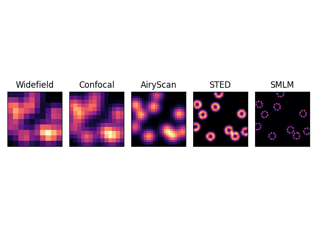
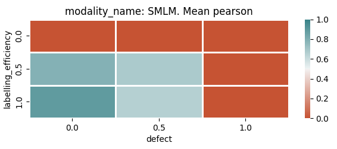
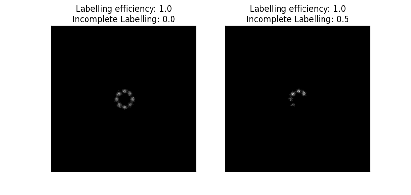
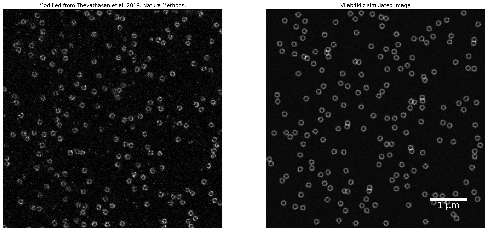

# VLab4Mic example scripts

If you have not install VLab4Mic yet, refer to the [manual](https://github.com/HenriquesLab/VLab4Mic/blob/main/manual.md) for detailed instructions of installation.

To run the example scripts, download a copy of the script by clicking on the "script" badge in the following table. Then use this command in your virtual environment:

```bash
python path/to/script.py
```

## Table of available scripts 

| Category | Description | File |
| --- | --- | --- |
| **Image virutal sample** | Create a virtual sample and simulate its imaging acquisition| [](https://github.com/HenriquesLab/VLab4Mic/blob/main/examples/image_virtual_sample.py)|
| **Parameter sweep** | Set up and run a parameter sweep analysis | [](https://github.com/HenriquesLab/VLab4Mic/blob/main/examples/parameter_sweep.py)|
| **Real vs Simulation** | Create a simulated image based on a real experiment image | [](https://github.com/HenriquesLab/VLab4Mic/blob/main/examples/real_vs_simulation.py)|
| **Custom structure** | Image a virutal sample based on a custom PDB/CIF file. | [](https://github.com/HenriquesLab/VLab4Mic/blob/main/examples/custom_structure.py)|

## Image virutal sample 

This script shows the basic usage of VLab4Mic method "image_vsample". With this high-level function you will be able to run an imaging simulation specifying:
- stucture of interest
- probe (model, type, target sites, etc.)
- virtual sample parameters (number of particles, for instance)
- Imaging modalities to use and their acquisitions parameters
- and many more.

In this example we select a NPC model, labelled at the C-terminal of Nup96.

Then we place 10 NPCs in a FOV for which we simulate their acquisition with different imaging modalities.

Example output from this script:



## Parameter sweep

This script exemplify the usage of the high-level function "run_parameter_sweep" to parameterise and run a parameter sweep analysis. This includes setting up:
- Structures, probes and modalities to use
- Parameter values to sweep
- Reference image
- Analysis metrics
- ...

In this example we select a NPC model, labelled at the C-terminal of Nup96.

Then we set up parameters for sweep:
- Labelling efficiency: 3 values from 0 to 1
- Incomplete labelling (or defects):  3 values from 0 to 1

We then compare each image output against a reference, for example, by calculating its pearson correlation.

Example output heatmap for the parameter sweep:



Example images generated with parameter sweep:



## Real vs Simulation

In this example, we show how you can use VLab4Mic to create an imaging simulation based on a real image.

Here, we use an available image of nuclear pore complexes (NPC) imaged with STED microscopy.
VLab4Mic first creates a virtual sample where the position of the labelled particles are estimated from a real STED microscopy image.
Then, we simulate the acquisition of this virtual sample with a model for STED microscopy to simulate an image that resembles the real acquisition.

The script generates an image with a side to side comparison of the real image and the simulated image of the same modality.

Example output from this script:



> Note that you can use other models for the structure, probes and modalities.

## Custom structure

This example show how to run an imaging simulation from custom PDB/CIF provided by the user. The rest of the functionality follows "Image virutal sample" script.